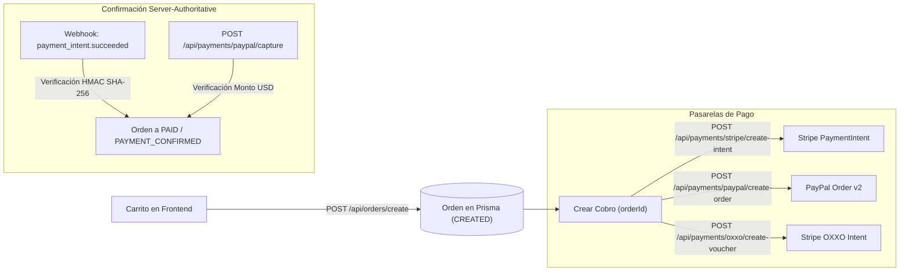

# BANELIO — AUDITORÍA TÉCNICA INTEGRAL

**Fecha:** 2026-09-16  
**Auditor Técnico:** Auditor Técnico Principal (AI Assistant)  
**Directorio de Trabajo Confirmado:** `/srv/projects/banelio` (enlace simbólico resuelto a `/srv/banelio/project`)  
**Modo de Ejecución:** Solo Lectura Estricto (Read-Only). Cero modificaciones a código fuente, esquemas, migraciones o base de datos.  
**Propósito:** Evaluación exhaustiva del estado real del sistema para servir como base técnica para el equipo de desarrollo y agentes autónomos (OpenCode + Ollama).

---

## 1. Resumen Ejecutivo

El proyecto **BANELIO** es una plataforma web para la comercialización, registro y transferencia de dominios, hosting en la nube NVMe, correo corporativo, certificados SSL y programa de afiliados/resellers.

La auditoría técnica revela que **BANELIO se encuentra en una fase de transición arquitectónica híbrida**:
1. **Núcleo de Órdenes, Catálogo y Pagos (Backend):** Es el área con mayor madurez técnica reciente. Implementa un motor server-authoritative en Node.js/Express y Prisma ORM (SQLite en desarrollo) con validación estricta de SKUs, cálculo centralizado de impuestos (11 países + internacional) y desacoplamiento de estados de pago y aprovisionamiento.
2. **Consultas de Disponibilidad y WHOIS:** Funciona de forma **REAL** conectándose mediante proxies a los endpoints PHP remotos activos de `https://banelio.com/api/domains/check.php` y a la infraestructura oficial de IANA RDAP (RFC 7482/7483).
3. **Autenticación, Clientes, Panel Administrativo y Partners:** Se encuentran en estado **SIMULATED / MOCK**. La autenticación reside exclusivamente en el cliente (`localStorage`), no hay sesiones HTTP ni JWT en el backend, no existen tablas de usuarios autenticables con contraseñas en la base de datos y cualquier contraseña permite el acceso como Administrador Root.
4. **Aprovisionamiento (Hosting, Email, SSL, Dominios):** Está **NOT_IMPLEMENTED**. A pesar de existir una interfaz completa y un catálogo con planes y precios, no existe lógica de aprovisionamiento con cPanel/WHM, Plesk, servidores de correo, emisores SSL ni conexión directa de registro de dominios con ResellerClub/OrderBox desde este servidor.

---

## 2. Estado General

- **Compilación de Código:** Limpia. `tsc --noEmit` ejecuta sin errores de tipos en todo el proyecto.
- **Servidor Activo:** Proceso Express/tsx corriendo en puerto `3000` (`http://0.0.0.0:3000`).
- **Base de Datos:** SQLite (`prisma/dev.db`) con 36 items de catálogo sembrados, 3 registros de clientes de prueba y 14 órdenes generadas en pruebas previas.
- **Conectividad Externa:** Salida HTTPS funcional hacia `banelio.com`, `data.iana.org` y `open.er-api.com`.
- **Integraciones con Gateways:** Código implementado para Stripe y PayPal pero sin credenciales configuradas en el entorno local (modo `not_configured` reportado por `/api/health`).

---

## 3. Arquitectura

El sistema responde a una arquitectura desacoplada en transición:

```mermaid
flowchart TD
    subgraph Browser ["Frontend SPA (React 19 + Tailwind v4 + Vite)"]
        UI_Home["Landing & Búsqueda"]
        UI_Checkout["Checkout Modal"]
        UI_Dash["Customer Dashboard"]
        UI_Admin["Admin Console"]
        UI_Reseller["Reseller Portal"]
        AppContext["AppContext (React Context + localStorage)"]
    end

    subgraph Backend ["Backend API (Node.js + Express 4)"]
        ServerTS["server.ts (Express)"]
        OrdersEngine["server/orders.ts (Server-Authoritative)"]
        CatalogEngine["server/catalog.ts (Pricing & SKUs)"]
        TaxEngine["server/tax.ts (Impuestos por País)"]
        PaymentsEngine["server/payments.ts (Stripe / PayPal / FX)"]
        HealthModule["server/health.ts"]
    end

    subgraph Database ["Persistencia (Prisma ORM)"]
        PrismaDB[("prisma/dev.db (SQLite)")]
    end

    subgraph External ["Servicios Externos"]
        BanelioPHP["https://banelio.com/api/domains/ (PHP APIs)"]
        IanaRDAP["https://data.iana.org/rdap/ (IANA DNS RDAP)"]
        StripeAPI["https://api.stripe.com (Stripe REST API)"]
        PayPalAPI["https://api-m.paypal.com (PayPal v2)"]
        FXAPI["https://open.er-api.com/v6/latest/USD"]
    end

    UI_Home -->|"/api/domains/check.php"| ServerTS
    UI_Home -->|"/api/domains/whois"| ServerTS
    UI_Checkout -->|"/api/orders/create"| ServerTS
    UI_Checkout -->|"/api/payments/*"| ServerTS
    
    ServerTS --> OrdersEngine
    ServerTS --> CatalogEngine
    ServerTS --> TaxEngine
    ServerTS --> PaymentsEngine
    ServerTS --> HealthModule

    OrdersEngine --> PrismaDB
    CatalogEngine --> PrismaDB

    ServerTS -->|"Proxy GET"| BanelioPHP
    ServerTS -->|"Bootstrap / Lookup"| IanaRDAP
    PaymentsEngine -->|"REST HTTP"| StripeAPI
    PaymentsEngine -->|"REST HTTP"| PayPalAPI
    PaymentsEngine -->|"REST HTTP"| FXAPI

    AppContext -.->|"Mock State (localStorage)"| UI_Dash
    AppContext -.->|"Mock State (localStorage)"| UI_Admin
    AppContext -.->|"Mock State (localStorage)"| UI_Reseller
```



---

## 4. Stack Tecnológico

| Capa | Tecnología | Versión | Propósito |
| :--- | :--- | :--- | :--- |
| **Frontend Framework** | React | 19.0.1 | Biblioteca de UI declarativa |
| **Build Tool** | Vite | 6.2.3 | Empaquetado y HMR |
| **Estilos** | Tailwind CSS | 4.1.14 | Utilidades CSS de última generación |
| **Animaciones** | GSAP / Motion | 3.15.0 / 12.23.24 | Animaciones de tarjetas y transiciones |
| **Iconografía** | Lucide React | 0.546.0 | Iconos del sistema |
| **Generación PDF** | jsPDF + jsPDF-AutoTable | 4.2.1 / 5.0.8 | Generación de facturas fiscales en cliente |
| **Backend Runtime** | Node.js | v22 | Ejecución de servidor |
| **Servidor Web / API** | Express | 4.21.2 | Enrutamiento HTTP y middlewares |
| **TypeScript Runtime** | tsx / esbuild | 4.21.0 / 0.25.0 | Ejecución y transpilación en desarrollo/build |
| **ORM** | Prisma Client | 6.19.3 | Modelado y consulta de base de datos |
| **Base de Datos** | SQLite | 3 | Base relacional local (`prisma/dev.db`) |
| **Seguridad de Passwords** | bcryptjs | 3.0.3 | Dependencia instalada (no integrada en backend) |
| **Seguridad HTTP** | Helmet, CORS, Express-Rate-Limit | Últimas | Instaladas en `package.json` (no activadas en `server.ts`) |
| **IA Generativa** | @google/genai | 2.4.0 | Instalada en `package.json` (no referenciada en código) |

---

## 5. Inventario de Funcionalidades

1. **Búsqueda de Disponibilidad de Dominios:** Entrada de texto, sanitización y consulta en tiempo real vía proxy backend.
2. **Consulta WHOIS / RDAP:** Modal emergente que consulta datos oficiales de registradores, fechas y nameservers.
3. **Consulta de Elegibilidad de Transferencia:** Verificación de estado del dominio para traslado hacia Banelio.
4. **Catálogo Unificado Server-Side:** 36 SKUs que cubren Dominios (12 TLDs), Hosting (Starter, Pro, Enterprise mensual/anual), Email, SSL y Addons.
5. **Motor de Precios e Impuestos:** Tasas de IVA/VAT automáticas para 11 países con fallback internacional.
6. **Carrito de Compras y Checkout:** Gestión de items, selección de periodo, addons y cálculo de totales en tiempo real.
7. **Pasarela Stripe (Tarjetas):** Creación de PaymentIntents server-side leyendo el total de la orden en base de datos.
8. **Pasarela Stripe (OXXO Pay):** Generación de voucher de 14 dígitos en MXN con conversión de divisas en tiempo real.
9. **Pasarela PayPal:** Creación y captura de órdenes server-side con verificación estricta del monto recibido.
10. **Webhooks Stripe:** Manejo de eventos `payment_intent.succeeded`, `payment_failed` y `charge.refunded` con HMAC SHA-256.
11. **Panel de Control de Cliente (Dashboard):** Vista de servicios contratados, gestión DNS, descargas de facturas y tickets.
12. **Consola de Administración (Admin Dashboard):** Vista de gestión de precios, cola de aprovisionamiento, payouts y logs.
13. **Portal de Afiliados / Resellers:** Generación de enlaces de referido, cálculo de comisiones al 30% y solicitudes de retiro.
14. **Sistema de Tickets de Soporte:** Creación de hilos, respuestas y actualización de estado.
15. **Centro de Control Backend (`/dev`):** Panel HTML interno para inspección de salud, base de datos y APIs.
16. **Generador de Facturas Fiscales en PDF:** Renderizado en el navegador con detalles del pedido, impuestos y desglose.
17. **Blog Técnico y Base de Conocimientos:** Artículos técnicos con CRUD en memoria y filtrado por categoría.
18. **Cumplimiento Legal y Cookies:** Modales con Términos, Política de Privacidad y banner de consentimiento.

---

## 6. Tabla de Clasificación Obligatoria

| Funcionalidad | Categoría | Evidencia Técnica | Conclusión |
| :--- | :--- | :--- | :--- |
| **Consulta Disponibilidad Dominios** | **REAL** | `server.ts` L103-134; `src/services/domainService.ts` L203-328; proxy a `banelio.com/api/domains/check.php`. | Responde datos reales del registro (ej. `regthroughothers`, `available`). |
| **Consulta WHOIS / RDAP** | **REAL** | `server.ts` L369-450; `WhoisModal.tsx`; consulta a `data.iana.org/rdap/dns.json`. | Extrae registrador, fechas de creación/expiración y nameservers reales. |
| **Consulta Elegibilidad Transferencia** | **REAL** | `server.ts` L137-167; proxy a `banelio.com/api/domains/transfer.php`. | Determina correctamente si el dominio es transferible. |
| **Catálogo de Productos y SKUs** | **REAL** | `server/catalog.ts`; sembrado automático en `prisma.catalogItem` (36 registros activos). | Catálogo persistido y consistente con la tienda. |
| **Cálculo Fiscal / Impuestos** | **REAL** | `server/tax.ts`; endpoint `GET /api/tax/:country`. | El servidor determina las tasas reales (ej. 16% México, 21% España). |
| **Creación Idempotente de Órdenes** | **REAL** | `server/orders.ts` L113-270; endpoint `POST /api/orders/create`. | Persiste en SQLite validando precios, rechazando montos del cliente. |
| **Cálculo FX USD -> MXN** | **REAL** | `server/payments.ts` L46-75; consulta live a `open.er-api.com/v6/latest/USD`. | Obtiene tasa bancaria/mercado real en tiempo real con caché de 1h. |
| **Health Check y Diagnóstico** | **REAL** | `server/health.ts`; endpoint `GET /api/health`. | Reporta estado real de DB, conteos e integraciones sanitizadas. |
| **Generación de Facturas PDF** | **REAL** | `src/utils/pdfGenerator.ts`; biblioteca `jspdf` y `jspdf-autotable`. | Descarga localmente un PDF con el desglose de la orden. |
| **Verificación Webhook Stripe** | **REAL** | `server/payments.ts` L90-145; verificación criptográfica HMAC SHA-256 nativa. | Código robusto que transiciona órdenes a `PAYMENT_CONFIRMED`. |
| **Pasarela Stripe (Tarjetas)** | **PARTIAL** | `server/payments.ts` L162-205; `CheckoutModal.tsx` L363-400. | Backend crea PaymentIntent real, pero en frontend falta Stripe Elements/Stripe.js para tokenizar la tarjeta. |
| **Pasarela PayPal (Checkout)** | **PARTIAL** | `server/payments.ts` L241-331; `CheckoutModal.tsx` L402-441. | Backend crea y captura órdenes v2 de forma autoritativa, pero requiere credenciales en `.env`. |
| **Pasarela Stripe (OXXO Pay)** | **PARTIAL** | `server.ts` L748-825; `server/payments.ts` L162. | Backend genera el PaymentIntent de tipo OXXO, pero requiere `STRIPE_SECRET_KEY` configurada. |
| **Precios de Transferencia / Renewal** | **NOT_CONFIGURED** | `server/catalog.ts` L315-316; arrays `TRANSFER_TLDS = []` y `RENEWAL_TLDS = []`. | Endpoints devuelven lista vacía y bloquean compras sin precio real configurado. |
| **Credenciales de Gateways de Pago** | **NOT_CONFIGURED** | `server/health.ts` y salida de `/api/health`. | Variables `STRIPE_SECRET_KEY`, `PAYPAL_CLIENT_ID`, `PAYPAL_CLIENT_SECRET` vacías. |
| **Credenciales ResellerClub Directas** | **NOT_CONFIGURED** | `.env.example` L30-45; ausencia de consumo en `server.ts`. | Se definen variables en `.env.example`, pero `server.ts` delega en el proxy PHP. |
| **Autenticación de Clientes** | **SIMULATED** | `AppContext.tsx` L377-420; `localStorage.getItem('banelio_registered_accounts')`. | No existe sesión en servidor, no hay JWT/cookies; acepta cualquier contraseña. |
| **Autenticación Administrativa** | **SIMULATED** | `AppContext.tsx` L657-666; `localStorage.setItem('banelio_admin_auth', 'true')`. | Cualquier usuario que envíe el formulario entra como Admin Root. |
| **Autenticación en Dos Pasos (2FA)** | **SIMULATED** | `AppContext.tsx` L513-541; secreto hardcodeado `JBSWY3DPEHPK3PXP`. | Cualquier código de 6 dígitos es aceptado como válido. |
| **Verificación de Email** | **SIMULATED** | `AppContext.tsx` L496-510; `setTimeout` de 600ms y validación `>= 4`. | No despacha correo SMTP/transaccional; valida localmente en memoria. |
| **Gestión de Registros DNS** | **SIMULATED** | `AppContext.tsx` L921-961; mutación en `localStorage` (`gh_services`). | No conecta con ningún servidor DNS, Bind, PowerDNS ni ResellerClub DNS. |
| **Sistema de Soporte / Tickets** | **SIMULATED** | `AppContext.tsx` L1112-1174; guardado exclusivo en `localStorage` (`gh_tickets`). | No persiste en la base de datos ni envía notificaciones. |
| **Comisiones y Retiros de Afiliados**| **SIMULATED** | `AppContext.tsx` L1177-1232; guardado en `localStorage` (`gh_payouts`). | No hay registro en base de datos de comisiones ni pagos automáticos. |
| **Aprovisionamiento de Dominios** | **NOT_IMPLEMENTED** | `server.ts` L837; `server/orders.ts` L256; `provisionStatus = 'NONE'`. | Tras pagar, la orden no registra el dominio en ningún registrador. |
| **Aprovisionamiento de Hosting** | **NOT_IMPLEMENTED** | Ausencia total de llamadas a WHM/cPanel o API de servidores. | No se crean cuentas de hosting, ni bases de datos ni accesos cPanel. |
| **Aprovisionamiento de Email** | **NOT_IMPLEMENTED** | No existen adaptadores ni endpoints para servidores de correo. | Los planes de correo no crean buzones en ningún servidor de mensajería. |
| **Aprovisionamiento de SSL** | **NOT_IMPLEMENTED** | Ausencia de hooks Certbot, Let's Encrypt o APIs Sectigo. | No se emiten certificados ni se gestionan CSRs. |
| **Sugerencias de Dominios con IA** | **NOT_IMPLEMENTED** | `server.ts` L491; responde 503; `@google/genai` sin usar. | El endpoint retorna honestamente no implementado. |
| **Fallback en Auth/EPP Code Update**| **BROKEN** | `server.ts` L247-251; bloque `catch` retorna `success: true`. | Retorna éxito al cliente aun cuando el proxy backend falle. |

---

## 7. Frontend

### Rutas y Vistas
El frontend no utiliza `react-router-dom`; implementa enrutamiento propio mediante `window.location.pathname`, el evento `popstate` y el estado `currentRoute` en `src/App.tsx`.
- `/` -> `CleanHomeLanding` (HeroDomainSearch, HostingPlans, EmailAndSsl, FaqSection)
- `/dominios` -> `DomainsLanding`
- `/hosting` -> `HostingLanding`
- `/email` -> `EmailLanding`
- `/ssl` -> `SslLanding`
- `/afiliados` -> `AffiliatesLanding`
- `/blog` -> `BlogLanding` / `BlogPostDetail`

### Separación de Roles en UI
El componente `App.tsx` conmuta según el valor de `role`:
- `PUBLIC`: Muestra la tienda y landing pages.
- `CUSTOMER`: Muestra `CustomerDashboard` si `customerUser` existe; si no, `CustomerAuthView`.
- `RESELLER`: Muestra `ResellerPortal` si `affiliateUser` existe; si no, `AffiliateAuthView`.
- `ADMIN`: Muestra `AdminDashboard` si `isAdminAuthenticated === true`; si no, `AdminAuthView`.

### Discrepancias Detectadas entre UI y Backend
1. **Facturación Fiscal en PDF:** El archivo `src/utils/pdfGenerator.ts` tiene hardcodeado en la línea 22 el nombre de marca `"GLOBALHOST CLOUD"`, mientras que la marca oficial es `"BANELIO"`.
2. **Formulario de Tarjeta de Crédito:** `CheckoutModal.tsx` contiene campos de entrada de texto plano para número de tarjeta, expiración y CVC. Sin embargo, estos valores nunca son procesados por el backend (el backend únicamente genera el intent mediante `orderId`).

---

## 8. Backend

### Estructura de Módulos
- `server.ts`: Archivo principal. Inicia Express, integra el middleware de Vite en desarrollo o sirve el directorio estático `dist` en producción, define endpoints HTTP y ejecuta el sembrado inicial del catálogo.
- `server/db.ts`: Instancia única de `PrismaClient` resolviendo de forma canónica la ruta del archivo `prisma/dev.db`.
- `server/catalog.ts`: Definición de catálogo y cálculo de márgenes comerciales para dominios y hosting.
- `server/tax.ts`: Definición y normalización de tasas de impuesto por país.
- `server/orders.ts`: Lógica server-authoritative de órdenes (creación, validación, cálculo de descuentos y transiciones de estado).
- `server/payments.ts`: Clientes HTTP nativos para Stripe y PayPal, verificación de firmas de webhooks y cálculo de cambio de divisas.
- `server/health.ts`: Lógica de diagnóstico y reporte de salud de la plataforma.
- `server/devPage.ts`: Plantilla HTML para la consola `/dev`.

### Principio "Server-Authoritative"
El backend implementa un patrón robusto contra manipulación de precios:
- La función `assertNoForbiddenFields()` en `server/orders.ts` (L101-107) rechaza cualquier solicitud que intente enviar `subtotal`, `tax`, `total`, `unitPrice`, `status`, etc.
- El servidor busca los SKUs en `prisma.catalogItem`, multiplica por la cantidad autorizada, consulta `server/tax.ts` y calcula el total de forma inmutable.

---

## 9. APIs

### Catálogo Completo de Endpoints

| Ruta | Método | Autenticación | Propósito | Estado Real |
| :--- | :--- | :--- | :--- | :--- |
| `/api/health` | GET | Ninguna | Chequeo de salud del sistema, base de datos e integraciones | REAL |
| `/api/catalog` | GET | Ninguna | Lista de productos y precios activos desde la DB | REAL |
| `/api/tax/:country` | GET | Ninguna | Tasa de impuesto según código ISO alpha-2 | REAL |
| `/api/tax` | GET | Ninguna | Lista de todos los países e impuestos soportados | REAL |
| `/api/orders/create` | POST | Ninguna (Guest) | Creación idempotente de órdenes server-authoritative | REAL |
| `/api/orders/:id` | GET | Ninguna | Consulta de orden por ID en base de datos | REAL (IDOR) |
| `/api/domains/whois` | GET | Ninguna | Consulta WHOIS mediante IANA RDAP | REAL |
| `/api/domains/check.php` | GET | Ninguna | Proxy a API externa de disponibilidad de dominios | REAL |
| `/api/domains/check` | GET | Ninguna | Alias de verificación de dominios | REAL |
| `/api/domains/transfer.php` | GET | Ninguna | Proxy a API externa de elegibilidad de transferencias | REAL |
| `/api/domains/transfer-order.php` | POST | Ninguna | Proxy para registrar orden de transferencia remota | REAL |
| `/api/domains/transfer-auth.php` | POST | Ninguna | Proxy para actualizar código Auth/EPP | BROKEN (Catch) |
| `/api/domains/transfer-status.php` | GET | Ninguna | Proxy para consultar estado de transferencias | REAL |
| `/api/domains/customer.php` | GET | Ninguna | Proxy para consulta de cliente en registry | REAL |
| `/api/domains/contacts.php` | GET | Ninguna | Proxy para consulta de contactos en registry | REAL |
| `/api/registry/status` | GET | Ninguna | Diagnóstico de credenciales del registry | REAL |
| `/api/domains/suggest` | GET | Ninguna | Sugerencias inteligentes de dominios | NOT_IMPLEMENTED |
| `/api/payments/config` | GET | Ninguna | Retorna llaves públicas y tasa FX USD/MXN | REAL |
| `/api/payments/stripe/create-intent` | POST | Ninguna | Crea PaymentIntent en Stripe leyendo total de DB | PARTIAL |
| `/api/payments/stripe/retrieve` | POST | Ninguna | Consulta estado de PaymentIntent y orden local | REAL |
| `/api/payments/stripe/oxxo-intent` | POST | Ninguna | Genera voucher OXXO con conversión a MXN | PARTIAL |
| `/api/payments/oxxo/create-voucher` | POST | Ninguna | Alias de generación de voucher OXXO | PARTIAL |
| `/api/payments/paypal/create-order` | POST | Ninguna | Crea orden en PayPal Checkout v2 leyendo DB | PARTIAL |
| `/api/payments/paypal/capture` | POST | Ninguna | Captura orden de PayPal y valida monto | PARTIAL |
| `/api/webhooks/stripe` | POST | HMAC SHA-256 | Recibe eventos de Stripe y transiciona a PAID | REAL |
| `/api/transfers/pricing` | GET | Ninguna | Precios de transferencias y renovaciones | NOT_CONFIGURED |
| `/dev` | GET | Ninguna | Consola de desarrollo y diagnóstico backend | BROKEN (Sin Auth) |

---

## 10. Base de Datos

### Esquema Prisma (`prisma/schema.prisma`)
La base de datos modela 3 entidades principales:
1. **`Customer`**: `id`, `email`, `name`, `phone`, `passwordHash`, `role`, `status`, `createdAt`, `updatedAt`.
2. **`CatalogItem`**: `id`, `sku`, `name`, `description`, `category`, `price` (Decimal), `currency`, `billingPeriod`, `active`, `metadata` (Json), fechas.
3. **`Order`**: `id`, `idempotencyKey`, `customerId`, `status`, `paymentStatus`, `provisionStatus`, `currency`, `subtotal`, `discount`, `taxBase`, `taxRate`, `tax`, `total`, `failureReason`, `gatewayReference`, `paymentMethod`, `items` (Json), fechas.

### Tablas Faltantes en el Modelo Relacional
Actualmente NO existen en la base de datos modelos para:
- `Domain` (dominios registrados, fechas de renovación, nameservers).
- `HostingAccount` / `Server` (cuentas, usuarios cPanel, límites).
- `Mailbox` (cuentas de correo, contraseñas, cuotas).
- `SslCertificate` (certificados, claves privadas, dominios asociados).
- `SupportTicket` / `TicketMessage` (tickets de atención a clientes).
- `AffiliateCommission` / `Payout` (comisiones y transacciones de partners).
- `DnsRecord` (registros tipo A, CNAME, MX, TXT).
- `Session` / `AuthToken` (sesiones activas de usuarios y administradores).

---

## 11. Autenticación

### Diagnóstico de Vulnerabilidad Crítica en Autenticación
1. **Ausencia de Autenticación en Servidor:** El backend no emite cookies `Set-Cookie`, no genera tokens JWT, ni cuenta con middleware de protección de rutas privadas.
2. **Consola Root Expuesta:** En `src/components/auth/AdminAuthView.tsx`, la función `loginAdmin` otorga acceso incondicional:
   ```ts
   // src/context/AppContext.tsx:657
   const loginAdmin = async (_email: string, _password?: string, _pin?: string): Promise<boolean> => {
     setIsAdminAuthenticated(true);
     setRole('ADMIN');
     return true;
   };
   ```
3. **Persistencia en LocalStorage:** El estado de inicio de sesión de clientes y administradores se almacena en `localStorage` (`banelio_customer_user`, `banelio_admin_auth`). Cualquier usuario puede mutar estas llaves desde la consola del navegador y adquirir privilegios de cliente o administrador.
4. **Almacenamiento Inseguro de Contraseñas de Clientes:** En `registerCustomer` (`AppContext.tsx` L456), la contraseña se solicita pero no se hashea; las cuentas se almacenan en texto plano o se descartan dentro de la clave `banelio_registered_accounts` de `localStorage`.
5. **2FA Simulado:** El modal de 2FA acepta cualquier secuencia numérica de 6 dígitos mediante la expresión regular `/^\d+$/`.

---

## 12. Seguridad

### Clasificación de Problemas de Seguridad

| Nivel | Hallazgo | Evidencia Técnica | Impacto |
| :--- | :--- | :--- | :--- |
| **CRÍTICO** | **Bypass total de Autenticación y Autorización** | `AppContext.tsx` L657-666; ausencia de middleware de auth en `server.ts`. | Cualquier usuario puede acceder al panel administrativo y ver/modificar datos locales. |
| **ALTO** | **IDOR en Consulta de Órdenes** | `server.ts` L962-972 (`GET /api/orders/:id`). | Cualquier atacante que conozca o enumere IDs de órdenes puede leer información del cliente y compra. |
| **ALTO** | **Consola `/dev` sin Protección en Red Pública** | `server.ts` L980-984 (`GET /dev`). | Expone información de entorno, base de datos y estado de integraciones a cualquier visitante. |
| **ALTO** | **Falsa Aprobación de Auth Code en Fallo** | `server.ts` L247-251 (`POST /api/domains/transfer-auth.php`). | El bloque `catch` responde `success: true` cuando el proxy externo falla. |
| **MEDIO** | **Manipulación de Tarjetas fuera de PCI-DSS** | `CheckoutModal.tsx` L121-125 (inputs de tarjeta sin Stripe Elements). | Riesgo de captura de datos sensibles de tarjeta en el DOM sin tokenización externa. |
| **MEDIO** | **Ausencia de Rate Limiting y CORS en API** | `server.ts` no inicializa `express-rate-limit` ni `cors`. | Posibilidad de ataques de denegación de servicio o saturación de consultas hacia IANA RDAP. |
| **MEDIO** | **Base de Datos SQLite en Entorno Concurrente** | `prisma/schema.prisma` L8 (`provider = "sqlite"`). | Bloqueo de concurrencia de archivo (`SQLITE_BUSY`) ante ráfagas de escritura de órdenes y webhooks. |
| **BAJO** | **Secreto TOTP 2FA Hardcodeado** | `AppContext.tsx` L514 (`secret = 'JBSWY3DPEHPK3PXP'`). | No genera secretos criptográficos individuales por usuario. |

---

## 13. Dominios

### Estado de Operaciones de Dominio
- **Búsqueda de Disponibilidad:** **REAL**. Ejecuta la llamada hacia `https://banelio.com/api/domains/check.php?domain={domain}`, la cual consulta el registro y responde estados válidos (`available`, `regthroughothers`).
- **Precios Retail:** **REAL**. Se calculan en `server/catalog.ts` aplicando margen sobre el costo mayorista mediante la fórmula psicológica `$X.99`.
- **Registro Real de Dominio:** **NOT_IMPLEMENTED**. Tras el pago de la orden, el estado de aprovisionamiento permanece en `NONE`. No se envía orden de registro a ResellerClub ni a ninguna otra entidad registradora.
- **Modificación de Nameservers / Contactos Registrant:** **SIMULATED**. Solo se altera el estado local en React y `localStorage`.

---

## 14. WHOIS

- **Estado:** **REAL**.
- **Implementación:** `server.ts` (L358-450) y `src/components/shared/WhoisModal.tsx`.
- **Mecanismo:** Descarga el archivo oficial de bootstrap de la IANA (`https://data.iana.org/rdap/dns.json`), identifica la URL del servidor RDAP autoritativo para el TLD correspondiente (ej. `.com`, `.org`, `.mx`) y ejecuta la consulta de protocolo RDAP.
- **Campos Obtenidos:** Entidad registradora (`registrar`), estados del dominio (`status`), fechas de registro (`created`), expiración (`expires`), última modificación (`lastChanged`) y servidores de nombres (`nameservers`).

---

## 15. ResellerClub

- **Configuración:** `.env.example` contiene las variables `RESELLERCLUB_RESELLER_ID`, `RESELLERCLUB_API_KEY`, `RESELLERCLUB_ENVIRONMENT` y `RESELLERCLUB_API_BASE_URL`.
- **Consumo:** En el backend actual de Node.js (`server.ts`), NO existe ninguna llamada directa a las APIs de ResellerClub (`test.httpapi.com` o `httpapi.com`).
- **Arquitectura Actual:** La aplicación interactúa exclusivamente como proxy de llamadas HTTP dirigidas a los endpoints PHP alojados en `https://banelio.com/api/domains/`, los cuales actúan como la capa intermedia que contiene la lógica de ResellerClub.

---

## 16. Hosting

- **Estado:** **NOT_IMPLEMENTED**.
- **Planes en UI y Catálogo:** Existen 3 planes definidos en `src/components/public/HostingPlans.tsx` y sembrados en la base de datos:
  1. *Cloud Starter NVMe* (Mensual / Anual)
  2. *Cloud NVMe Pro Ultra* (Mensual / Anual)
  3. *Enterprise Cloud NVMe* (Mensual / Anual)
- **Aprovisionamiento:** Inexistente. No hay conexión con servidores dedicados, cPanel/WHM, Plesk, Docker o Kubernetes. No se generan cuentas de usuario, asignación de IP ni configuración de vhosts.

---

## 17. Email

- **Estado:** **NOT_IMPLEMENTED**.
- **Planes:** *Email Profesional*, *Email Suite Enterprise*, *Google Workspace Starter*, *Banelio Mail Pro*.
- **Aprovisionamiento:** Inexistente. No hay integración con servidores Postfix, Dovecot, cPanel Mail, Google Workspace Partner API ni servicios IMAP/SMTP.

---

## 18. SSL

- **Estado:** **NOT_IMPLEMENTED**.
- **Certificados Ofertados:** *Sectigo Essential SSL (DV)*, *PositiveSSL Wildcard*, *Comodo EV SSL*.
- **Aprovisionamiento:** Inexistente. No se generan solicitudes de firma de certificado (CSR), ni validaciones DNS/HTTP para Let's Encrypt o ZeroSSL, ni compras automáticas en Sectigo.

---

## 19. Pagos

### Diagnóstico de Pasarelas



- **Stripe:** Código backend completo para crear PaymentIntents leyendo montos directamente de la base de datos.
- **PayPal:** Código backend completo para órdenes v2 y captura server-side con verificación de monto.
- **OXXO Pay:** Generación de voucher de 14 dígitos en MXN mediante Stripe Sources/PaymentMethods con tasa de cambio real obtenida vía API pública.
- **Webhooks:** `server.ts` verifica la firma de webhooks de Stripe con tolerancia de 300 segundos.
- **Idempotencia:** Implementada mediante `idempotencyKey` en la tabla `Order`.
- **Estado Global de Pagos:** **PARTIAL / NOT_CONFIGURED** debido a la falta de llaves en variables de entorno y la ausencia de Stripe Elements en frontend.

---

## 20. Clientes

- **Registro y Acceso:** Simulado en el navegador (`localStorage`).
- **Base de Datos:** Existen 3 clientes en la tabla `Customer`, pero sin contraseñas registradas (`passwordHash: null`) y en estado `PENDING_VERIFICATION`.
- **Aislamiento entre Clientes:** No existe en el servidor. Al no haber sesiones autenticadas, un cliente en frontend puede modificar su propio identificador y consultar órdenes ajenas.

---

## 21. Administración

- **Panel:** `src/components/admin/AdminDashboard.tsx`.
- **Capacidades en UI:** Gestión de márgenes TLD, cola de aprovisionamiento, aprobación de payouts, inspección de tickets y modo impersonación de clientes.
- **Persistencia:** Todo el panel opera sobre el estado en memoria y `localStorage` (`gh_audit`, `gh_jobs`, `gh_payouts`). No hay endpoints de backend para que el administrador gestione la base de datos real.

---

## 22. Partners / Resellers

- **Portal:** `src/components/reseller/ResellerPortal.tsx`.
- **Lógica de Comisiones:** 30% fijo sobre compras con código de referido.
- **Persistencia:** Simulación en cliente. No existen tablas de afiliados, ni registro de clicks de referidos, ni pasarela de dispersión masiva de pagos (PayPal Payouts API o transferencias bancarias).

---

## 23. Dependencias

### Análisis de `package.json`

| Dependencia | Versión | Estado | Observación Técnica |
| :--- | :--- | :--- | :--- |
| `react` / `react-dom` | ^19.0.1 | Actual | Versión mayor moderna |
| `vite` | ^6.2.3 | Actual | Herramienta de compilación estable |
| `express` | ^4.21.2 | Actual | Servidor HTTP funcional |
| `@prisma/client` / `prisma` | ^6.19.3 | Actual | ORM correctamente sincronizado |
| `bcryptjs` | ^3.0.3 | No Utilizada | Instalada para hashing pero sin uso en backend |
| `cors` | ^2.8.6 | No Utilizada | Instalada pero no montada en `server.ts` |
| `helmet` | ^8.3.0 | No Utilizada | Instalada pero no montada en `server.ts` |
| `express-rate-limit` | ^8.7.0 | No Utilizada | Instalada pero no montada en `server.ts` |
| `@google/genai` | ^2.4.0 | No Utilizada | SDK instalado sin llamadas en el código |
| `stripe` (SDK) | Ausente | Reemplazada | El backend utiliza llamadas `fetch` nativas directas a Stripe |
| `@stripe/stripe-js` | Ausente | Faltante | Necesaria para montar Stripe Elements seguro en frontend |
| `@paypal/checkout-server-sdk`| Ausente | Reemplazada | El backend utiliza llamadas `fetch` directas a PayPal v2 |

---

## 24. Infraestructura

- **Servidor:** Linux Ubuntu/Debian.
- **Ruta del Proyecto:** `/srv/projects/banelio` (Symlink a `/srv/banelio/project`).
- **Puertos:** `3000` (Node/Express).
- **Proceso Activo:** PID 35151 ejecutando Node.
- **Persistencia de Base de Datos:** Archivo local SQLite `prisma/dev.db`.

---

## 25. Problemas Encontrados

1. **Autenticación Ficticia en Frontend:** La seguridad de acceso a cuentas de cliente y administración no se valida en el servidor.
2. **Exposición de Consola `/dev`:** No cuenta con control de acceso y se encuentra disponible en la raíz web.
3. **Falta de Middleware de Seguridad:** `server.ts` no activa `cors`, `helmet` ni `express-rate-limit` a pesar de estar instalados en el proyecto.
4. **Vulnerabilidad IDOR en `/api/orders/:id`:** Permite consultar cualquier orden sin comprobar la identidad de quien consulta.
5. **Fallback Falso en `/api/domains/transfer-auth.php`:** Si el servicio externo falla, la API responde éxito simulado.
6. **Falta de SDK de Tarjetas en Frontend:** `CheckoutModal.tsx` solicita datos de tarjeta de crédito mediante inputs no tokenizados.
7. **Discrepancia de Nombre de Marca en Facturas PDF:** `pdfGenerator.ts` emite facturas con la cabecera `"GLOBALHOST CLOUD"`.
8. **Inexistencia de Aprovisionamiento Real:** No hay código para registrar dominios pagados ni crear cuentas de hosting, correo o certificados SSL.

---

## 26. Riesgos

1. **Riesgo de Seguridad Crítico:** Exposición de panel de administración y manipulación de datos de clientes si se despliega a producción con la autenticación actual en `localStorage`.
2. **Riesgo Operativo:** Clientes que paguen órdenes de dominios o hosting verán su pago confirmado pero sus servicios nunca se activarán de forma automática.
3. **Riesgo de Cumplimiento (PCI-DSS):** Solicitar números de tarjeta en campos de texto normales sin utilizar un iframe de Stripe o PayPal expone a la plataforma a sanciones y responsabilidades legales.
4. **Riesgo de Concurrencia SQLite:** Bloqueos de base de datos en escenarios de múltiples compras simultáneas.

---

## 27. Funcionalidades Faltantes

1. Endpoints de backend para autenticación (`POST /api/auth/register`, `POST /api/auth/login`, `POST /api/auth/logout`, `GET /api/auth/me`).
2. Generación y validación de tokens de sesión seguros (Cookies HTTP-Only o JWT).
3. Hashing real de contraseñas con `bcryptjs` en la base de datos.
4. Integración de Stripe Elements (`@stripe/stripe-js`) en el modal de checkout.
5. Cola de tareas en segundo plano (BullMQ o similar) para aprovisionamiento asíncrono.
6. Módulo de conexión con API de aprovisionamiento de dominios (ResellerClub direct o proxy Banelio autenticado).
7. Módulo de aprovisionamiento de hosting (cPanel/WHM o panel compatible).
8. Modelos en `schema.prisma` para Dominios, Servicios de Hosting, Tickets y Afiliados.

---

## 28. Configuraciones Pendientes

1. Configurar variables de Stripe en `.env`: `STRIPE_SECRET_KEY`, `STRIPE_WEBHOOK_SECRET`, `VITE_STRIPE_PUBLISHABLE_KEY`.
2. Configurar variables de PayPal en `.env`: `PAYPAL_CLIENT_ID`, `PAYPAL_CLIENT_SECRET`, `PAYPAL_MODE`.
3. Configurar credenciales de registro de dominios en `.env`: `REGISTRY_PARTNER_ID`, `REGISTRY_API_KEY`.
4. Definir precios reales en `TRANSFER_TLDS` y `RENEWAL_TLDS` en `server/catalog.ts`.
5. Migrar `DATABASE_URL` hacia una base de datos PostgreSQL para producción.

---

## 29. Deuda Técnica

1. **Residuos de Proyecto Anterior ("GlobalHost"):** Claves en `localStorage` con prefijo `gh_` (`gh_orders`, `gh_services`, `gh_tlds`) y texto `"GLOBALHOST CLOUD"` en `pdfGenerator.ts`.
2. **Dependencias No Utilizadas:** Paquetes instalados (`@google/genai`, `bcryptjs`, `cors`, `helmet`, `express-rate-limit`) que ocupan espacio y no están integrados al flujo de ejecución.
3. **Código de Sugerencias No Conectado:** UI preparada para mostrar sugerencias inteligentes de dominios, pero endpoint backend responde 503.

---

## 30. Plan de Trabajo Recomendado

> [!IMPORTANT]
> Este plan de trabajo está diseñado en fases estrictamente desacopladas para su posterior ejecución guiada por **OpenCode + Ollama** y revisión de modelos de apoyo. **NO debe ejecutarse en esta fase de auditoría.**

### Fase 1: Hardening de Backend y Seguridad Base
- **Objetivo:** Cerrar brechas de seguridad críticas e inicializar middlewares de protección.
- **Archivos Afectados:** `server.ts`.
- **Cambios Necesarios:**
  1. Activar `helmet` para cabeceras HTTP seguras.
  2. Activar `cors` restringido a dominios autorizados.
  3. Activar `express-rate-limit` en rutas públicas de búsqueda y checkout.
  4. Restringir la ruta `/dev` para que no se exponga en `NODE_ENV=production`.
  5. Corregir el bloque `catch` de `POST /api/domains/transfer-auth.php` para retornar HTTP 502/error en lugar de éxito falso.
- **Riesgos:** Errores de CORS en desarrollo si no se configuran orígenes permitidos.
- **Validaciones:** Pruebas con `curl` verificando cabeceras de seguridad y respuestas ante límites de tasa.
- **Ejecución:** OpenCode + Ollama.

### Fase 2: Autenticación Real en Base de Datos y Sesiones
- **Objetivo:** Reemplazar el sistema de `localStorage` por autenticación de servidor con contraseñas seguras y sesiones.
- **Archivos Afectados:** `prisma/schema.prisma`, nuevo `server/auth.ts`, `server.ts`, `src/context/AppContext.tsx`, `src/components/auth/*`.
- **Cambios Necesarios:**
  1. Crear endpoints de backend: `POST /api/auth/register`, `POST /api/auth/login`, `POST /api/auth/logout`, `GET /api/auth/me`.
  2. Implementar hashing de contraseñas con `bcryptjs` en `server/auth.ts`.
  3. Emitir cookies HTTP-Only seguras o tokens JWT firmados para sesiones.
  4. Agregar middleware `requireAuth` y `requireAdmin` en rutas sensibles.
  5. Conectar los formularios de frontend con estos endpoints.
- **Riesgos:** Incompatibilidad con datos previamente guardados en navegadores locales.
- **Validaciones:** Intentos de login con contraseñas incorrectas (deben fallar) y acceso a `/admin` sin sesión (debe retornar 401/403).
- **Ejecución:** OpenCode + Ollama con supervisión de modelo avanzado para validación de seguridad.

### Fase 3: Aislamiento de Datos y Protección IDOR
- **Objetivo:** Garantizar que los clientes solo puedan acceder a sus propias órdenes y servicios.
- **Archivos Afectados:** `server/orders.ts`, `server.ts`.
- **Cambios Necesarios:**
  1. Modificar `GET /api/orders/:id` para validar que la orden pertenezca al usuario autenticado (o que el usuario sea ADMIN).
  2. Crear endpoint `GET /api/customer/orders` que consulte las órdenes del usuario en base de datos.
  3. Conectar la pestaña de órdenes y facturas del `CustomerDashboard` con la base de datos real.
- **Riesgos:** Clientes invitados (guest) sin cuenta requieren token de seguimiento de orden firmado.
- **Validaciones:** Comprobar que el usuario A no pueda leer la orden del usuario B.
- **Ejecución:** OpenCode + Ollama.

### Fase 4: Checkout Seguro con Stripe Elements
- **Objetivo:** Cumplir con PCI-DSS y permitir el cobro real de tarjetas de crédito.
- **Archivos Afectados:** `package.json`, `src/components/public/CheckoutModal.tsx`.
- **Cambios Necesarios:**
  1. Instalar `@stripe/stripe-js` y `@stripe/react-stripe-js`.
  2. Reemplazar los inputs planos de tarjeta en `CheckoutModal.tsx` por el componente `<PaymentElement />` o `<CardElement />`.
  3. Utilizar `stripe.confirmPayment()` en el cliente para confirmar el PaymentIntent devuelto por el servidor.
- **Riesgos:** Requiere que `VITE_STRIPE_PUBLISHABLE_KEY` esté configurada.
- **Validaciones:** Pruebas con tarjetas de prueba de Stripe en modo Sandbox.
- **Ejecución:** OpenCode + Ollama.

### Fase 5: Modelado de Persistencia para Servicios y Soporte
- **Objetivo:** Mover dominios, hosting, tickets y comisiones de `localStorage` a Prisma.
- **Archivos Afectados:** `prisma/schema.prisma`, `server/db.ts`, `server.ts`, componentes de Dashboard y Tickets.
- **Cambios Necesarios:**
  1. Agregar modelos `UserDomain`, `HostingService`, `SupportTicket`, `TicketMessage`, `AffiliateCommission`.
  2. Crear migración Prisma.
  3. Implementar endpoints CRUD para tickets y servicios en backend.
- **Riesgos:** Migración de base de datos requiere ejecución limpia sin romper esquemas.
- **Validaciones:** Creación de ticket en cliente y verificación de registro en tabla SQLite.
- **Ejecución:** OpenCode + Ollama.

### Fase 6: Módulo de Aprovisionamiento Asíncrono
- **Objetivo:** Conectar órdenes pagadas con el registro real de dominios y activación de servicios.
- **Archivos Afectados:** `server/provisioning.ts` (nuevo), `server/orders.ts`, `server.ts`.
- **Cambios Necesarios:**
  1. Implementar dispatcher tras webhook de pago confirmado.
  2. Conectar llamadas al registrar oficial para el registro de dominios.
  3. Actualizar `provisionStatus` a `PROVISIONING` y luego a `PROVISIONED` o `FAILED`.
- **Riesgos:** Fallos de conectividad con proveedores externos requieren lógica de reintentos y alertas.
- **Validaciones:** Mock testing de llamadas al proveedor con respuesta controlada.
- **Ejecución:** Requiere credenciales externas y supervisión de modelo avanzado.

### Fase 7: Limpieza de Marca y Deuda Técnica
- **Objetivo:** Homogeneizar branding y eliminar código muerto.
- **Archivos Afectados:** `src/utils/pdfGenerator.ts`, `src/data/mockData.ts`.
- **Cambios Necesarios:**
  1. Reemplazar `"GLOBALHOST CLOUD"` por `"BANELIO"` en la plantilla de facturación PDF.
  2. Renombrar llaves de `localStorage` de `gh_*` a `banelio_*`.
  3. Limpiar paquetes innecesarios de `package.json` si no se van a implementar (ej. `@google/genai`).
- **Riesgos:** Mínimos.
- **Validaciones:** Descargar factura PDF y verificar logotipo, colores y textos de Banelio.
- **Ejecución:** OpenCode + Ollama.

---

## 31. Validaciones Realizadas

Durante esta auditoría se llevaron a cabo las siguientes comprobaciones seguras y de solo lectura:
1. **Comprobación de Directorio (`pwd`):** Confirmado `/srv/banelio/project` vinculado a `/srv/projects/banelio`.
2. **Análisis Estático TypeScript:** `npm run lint` (`tsc --noEmit`) completado con código de salida `0` (sin errores de tipos).
3. **Inspección de Proceso Activo:** Confirmado proceso Node en PID `35151` escuchando en puerto `3000`.
4. **Health Check Local:** Consulta a `http://127.0.0.1:3000/api/health` confirmando estado `ok`, DB activa (36 items de catálogo, 14 órdenes, 3 clientes).
5. **Comprobación de Tasas de Cambio:** Consulta a `/api/payments/config` confirmando cálculo de divisa live en tiempo real vía `open.er-api.com`.
6. **Comprobación RDAP / WHOIS:** Consulta a `/api/domains/whois?domain=banelio.com` respondiendo datos reales emitidos por el registrador oficial (IONOS SE).
7. **Comprobación de Disponibilidad de Dominios Externa:** Consulta a `https://banelio.com/api/domains/check.php` con dominios reales y de prueba comprobando integración funcional.
8. **Inspección de Base de Datos:** Lectura no destructiva de conteos en `prisma/dev.db` mediante script Node efímero de solo lectura.

---

## 32. Conclusión Técnica

BANELIO posee una **base técnica sólida y moderna en su infraestructura de catálogo, precios y órdenes del lado del servidor**, con un diseño visual y de experiencia de usuario en frontend bien estructurado y funcional.

Sin embargo, **no está listo para producción** en su estado actual debido a que:
1. La autenticación y autorización están delegadas por completo al navegador (`localStorage`), dejando expuesto el panel de administración root a cualquier visitante.
2. El flujo de aprovisionamiento de servicios (dominios, hosting, email, SSL) no está implementado en backend.
3. El modal de checkout requiere la integración formal de Stripe Elements para cumplir con estándares de seguridad en manejo de tarjetas de crédito.

Siguiendo el **Plan de Trabajo Recomendado en 7 Fases**, el proyecto puede completarse de manera modular, segura y verificable utilizando OpenCode + Ollama para la implementación paso a paso.
